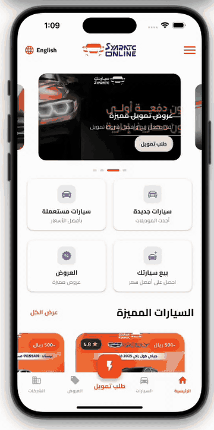
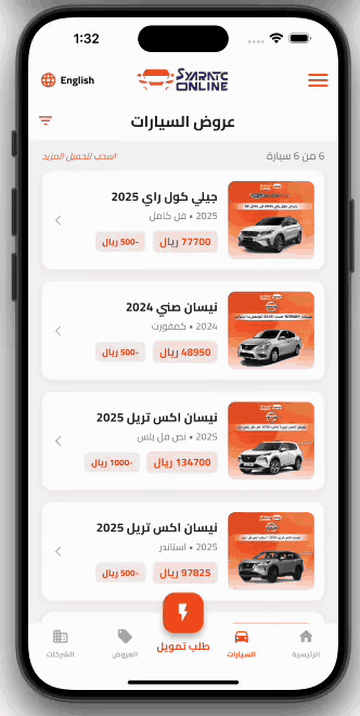

<div align="center">

  

  <h1>Syaratc Online</h1>

  <p>
    Find, finance, and manage cars with a modern, high‑performance Flutter app powered by clean architecture.
  </p>

  <p>
    <a href="https://syaratc.online/en"></a>
    <a href="https://play.google.com/store/apps/details?id=com.syatric.app"></a>
  </p>

</div>

## Overview

Syaratc Online is a car marketplace and financing companion. The app connects users with curated car offers, financing partners, and company programs while delivering a smooth, localized experience for both end‑users and companies. It mirrors the core capabilities available on the website (`https://syaratc.online/en`) and adds mobile‑first features like push notifications, offline‑first storage, and background token refresh.

### Project Pref

This repository hosts the app profile and demos only (no source code). Use this README on GitHub as a portfolio page to showcase product scope, technology choices, and videos.

## Technologies

| Layer | Technology |
|---|---|
| Language | Flutter, Dart |
| State | BLoC (Cubit) |
| Storage | Hive for local persistence |
| Architecture | Clean Architecture (domain, data, presentation) |
| Networking | API handler with interceptors, pagination, and error mapping |
| Auth | Token auth with OTP; secure refresh token in background; guest and authenticated flows |
| UI/UX | Slivers for performant lists, skeleton loading, onboarding game/flow |
| i18n | Double localization (Arabic and English) |
| Notifications | Firebase Cloud Messaging + local notifications (new offers, order updates, company campaigns) |
| Analytics | Firebase Analytics (events for conversion, OTP success, engagement) |
| Dependency Injection | get_it / injectable |
| Web Content | In‑app WebView for Terms and Conditions, Privacy |

## Screens & Features

- **Splash**: cold‑start bootstrap, env/config probing, auth state restore
- **Auth**: login and signup, OTP verification, resend/refresh OTP
- **Forgot Password**: password reset with secure flows
- **Background Token Refresh**: silent refresh for both guest and authenticated sessions
- **Onboarding Game**: playful onboarding flow that introduces features and increases activation
- **Home**: brand search, featured products, performant sliver lists, skeleton loading
- **Offers**: special/featured offers, filters, pagination
- **Order/Form**: guided purchase order form with validation and autosave
- **Companies Offers**: tailored programs for businesses
- **User Profile**: profile view/edit, saved cars, preferences
- **Drawer**: links to Terms & Conditions and Privacy via WebView

## Screenshots

Place screenshots here once available (recommended: 1242×2688 for portrait, with concise captions).

## Visual Architecture

```
App (Flutter)
├─ presentation/        # Widgets, pages, BLoC cubits, UI state
├─ domain/              # Entities, repositories (abstract), use‑cases
└─ data/                # DTOs, mappers, Hive boxes, API clients/interceptors

Cross‑cutting: localization, error handling, analytics, notifications
```

## Project Structure (planned)

```
lib/
├─ core/                      # app-wide building blocks
│  ├─ di/                     # dependency injection (get_it/injectable)
│  ├─ network/                # api client, interceptors, error mapping
│  ├─ localization/           # i18n setup (ar, en)
│  ├─ notifications/          # FCM + local notifications
│  ├─ utils/                  # formatters, validators, shared helpers
│  └─ widgets/                # reusable UI components
└─ features/                  # vertical slices by business area
   ├─ auth/                   # login, signup, otp, refresh
   ├─ onboarding/             # onboarding game/flow
   ├─ home/                   # brands, featured, skeletons
   ├─ offers/                 # lists, filters, pagination
   ├─ order/                  # order form, steps, validation
   ├─ companies/              # company programs
   ├─ profile/                # user profile
   └─ legal/                  # terms & privacy (WebView)
```

## Demos (GIF Previews)

> Lightweight GIFs play inline on GitHub; click any image for full size.

### Home


### Offers


### Onboarding & Auth


### Form & Drawer


Full video is also available on Google Drive:

- [Watch full demo](https://drive.google.com/file/d/17UQR6TMTeV9Ool-RF9koM8dw9yFTqBTI/view?usp=sharing)

## Why Syaratc Online?

- **End‑to‑end flow** from discovery to financing
- **Reliable performance** with slivers, pagination, and skeleton loading
- **Production‑ready architecture** (testable, scalable)
- **Localization‑first** experience
- **Engagement** via FCM + local notifications

<!-- Suggestions and questions intentionally kept out of README for brevity and professionalism. -->

## Getting Started (Profile Repo)

This is a profile/portfolio repository containing assets and documentation only. If you want the full source code or a custom build, please reach out.

---

Made with Flutter • © Syaratc Online


