<div align="center">

  

  <h1>Nawah Healthcare</h1>

  <p>
    A modern Flutter healthcare platform for consultations, branch discovery, and service booking across MENA.
  </p>

  <p>
    <strong>Status:</strong> 75% complete · QA & regression testing · Booking with multi-payment + social auth in progress
  </p>

  <p>
    
    
    
    
    
  </p>

</div>

## Overview

Nawah is a healthcare consultation companion that connects patients with clinics, branches, and specialists. The app delivers bilingual (Arabic/English) experiences, secure consultations with media attachments, dynamic branch/doctor availability, and targeted notifications for offers or follow-ups. The current build mirrors real production scope while we finish QA, add "Book Now" with multi-payment environments, and enable social authentication for faster onboarding.

- Target markets: Egypt · Saudi Arabia · GCC
- Deployment: Android first, iOS build under the same codebase
- Coverage: Consultations, services, branch locator, history, profile, notifications, settings

## Status & Roadmap

- ✅ Core flows: authentication, consultations, services, branches, notifications, localization
- ✅ Internal QA + beta testing (75% of backlog closed)
- 🚧 In progress: Booking & payments (multiple PSP environments), social auth, analytics events
- 🔜 Next: Rich booking summary, Apple Sign-In, provider-side messaging, App Store submission

## Technologies

| Layer | Stack |
|---|---|
| Language | Flutter, Dart |
| State | BLoC (flutter_bloc), Cubits, rxdart |
| Architecture | Clean Architecture (presentation · domain · data) |
| Networking | dio + retrofit + interceptors, connectivity_plus |
| Serialization | freezed, json_serializable, build_runner |
| Storage & Security | flutter_secure_storage, shared_preferences |
| UI/UX | Material 3 theming, flutter_screenutil, shimmer, cached_network_image, custom hero flows |
| Notifications | Firebase Cloud Messaging, flutter_local_notifications, timezone |
| Localization | easy_localization (AR/EN, RTL) |
| Analytics & Logging | Firebase Analytics events, pretty_dio_logger |
| Dependency Injection | get_it / injectable style service locator |

## Screens & Features

- **Splash & Session Restore**: Fast boot, env detection, token refresh, biometric resume
- **Auth**: OTP login/signup, password reset, biometric unlock, (Social auth coming in QA sprint)
- **Consultations**: Attach medical notes/photos, track status, receive responses
- **Services Catalog**: Filtered services with pricing, duration, and prerequisites
- **Branch Finder**: Live branch availability, working hours, map & directions
- **Booking (WIP)**: Pay-now & pay-later options, multi PSP environments, promo codes
- **Notifications**: Deep-linked push topics for offers, consultation updates, system alerts
- **Profile & Settings**: Preferences, language switch (instant RTL), security controls
- **System Reliability**: Offline awareness, retry logic, structured error surfaces

## Highlights

- Clean Architecture separation + feature-first folders for scalability
- Enterprise-grade session & token management with auto-refresh + secure storage
- Modern UX touches: hero motions, skeleton states, shimmer, custom loaders
- Deep localization: Arabic-first typography, mirrored layouts, localized notifications
- QA-ready: logging, analytics hooks, remote config toggles for staged rollouts

## Visual Architecture

```
App (Flutter) — Clean Architecture (presentation · domain · data)
├─ presentation/   # widgets, pages, cubits, UI logic
├─ domain/         # entities, repositories contracts, use-cases
└─ data/           # DTOs, retrofit clients, mappers, local persistence

Cross-cutting: localization, analytics, notifications, payments, error handling
```

## Project Structure (planned)

```
lib/
├─ core/
│  ├─ di/                   # dependency injection (GetIt registrations)
│  ├─ network/              # dio factory, interceptors, retrofit services
│  ├─ localization/         # easy_localization config, translation keys
│  ├─ services/             # firebase, notifications, secure storage
│  ├─ theme/                # colors, typography, Material 3 themes
│  ├─ utils/                # formatters, validators, helpers
│  └─ widgets/              # reusable UI components
├─ features/
│  ├─ auth/                 # login, signup, OTP, biometric, social
│  ├─ onboarding/           # first-run flow
│  ├─ consultations/        # submit, track, history
│  ├─ services/             # catalog, filters, booking hooks
│  ├─ branches/             # branch info, maps, availability
│  ├─ notifications/        # push center & topics
│  ├─ profile/              # user profile, settings, preferences
│  └─ main/                 # navigation shell, tabs
├─ data/                    # static configs, mock payloads
├─ injection_container.dart # GetIt bootstrapping
└─ main.dart                # entry point
```

## Hero Imagery

<table>
  <tr>
    <td>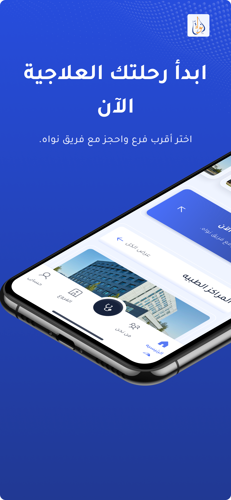</td>
    <td>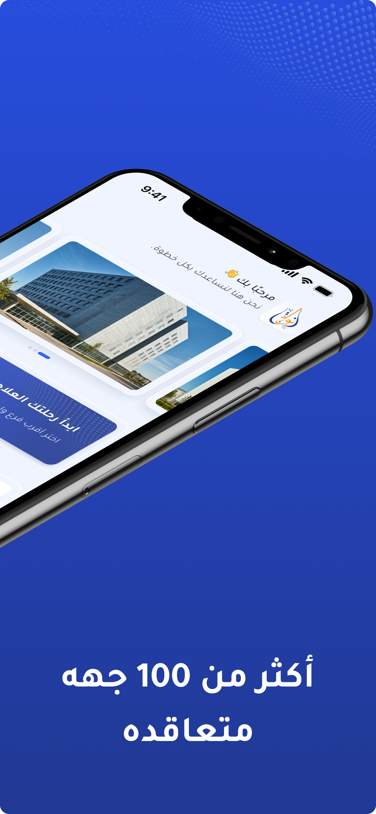</td>
    <td>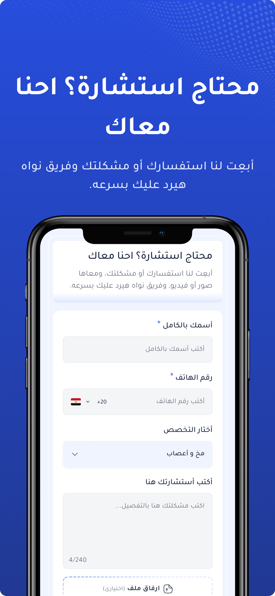</td>
  </tr>
  <tr>
    <td>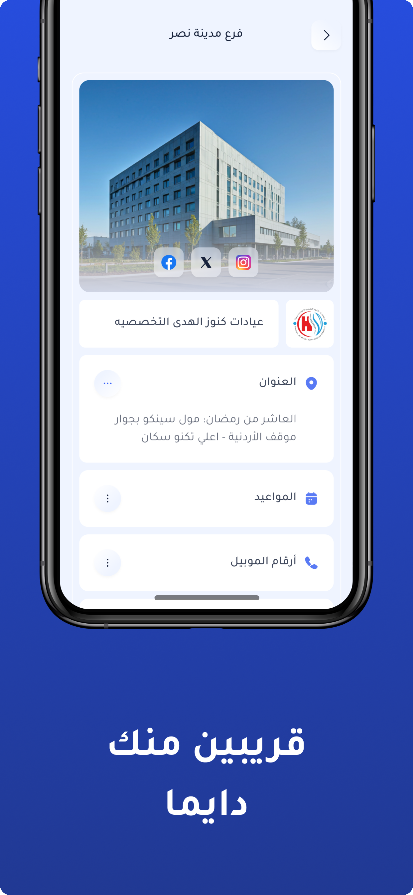</td>
    <td></td>
    <td></td>
  </tr>
</table>

## Screenshots

<table>
  <tr>
    <td>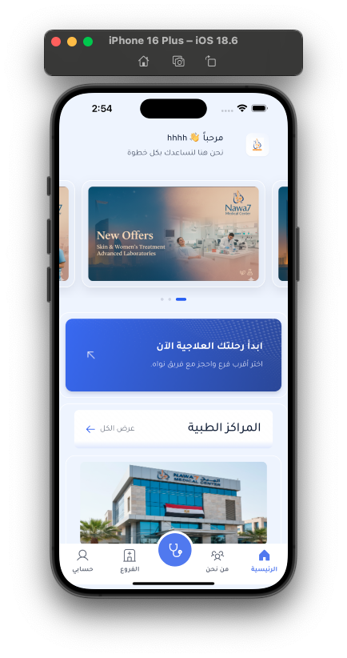</td>
    <td>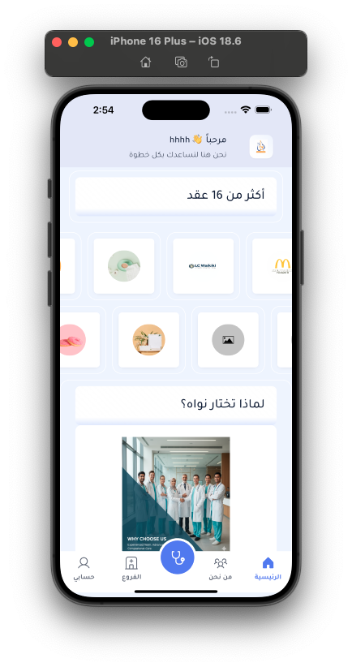</td>
    <td>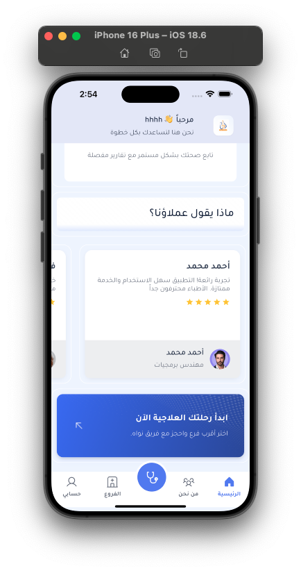</td>
    <td>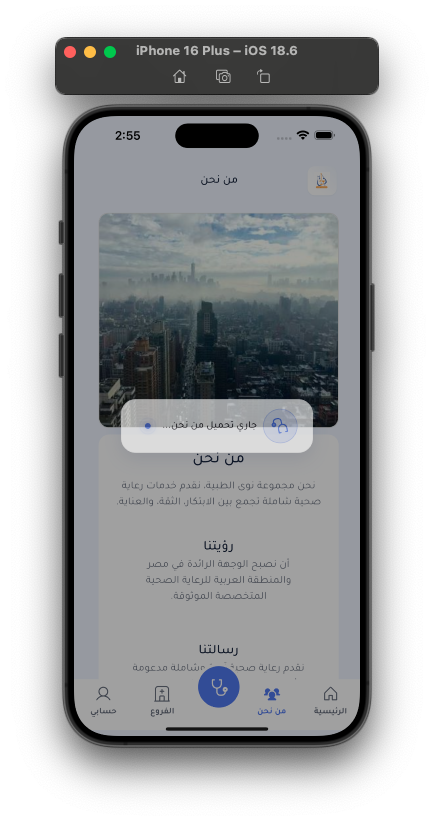</td>
  </tr>
  <tr>
    <td>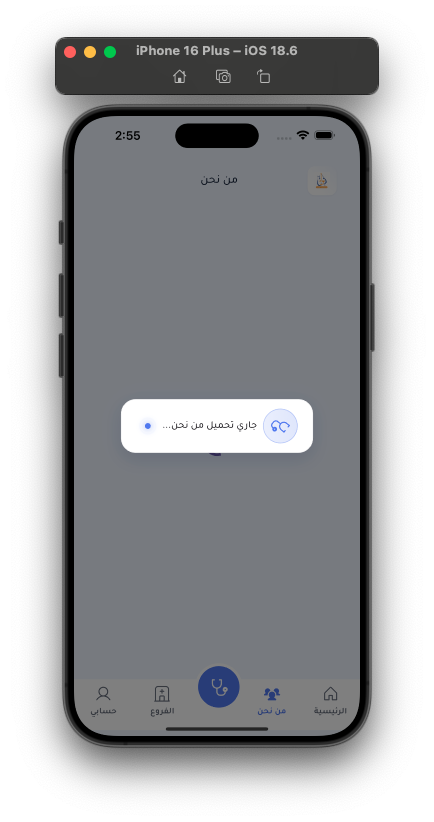</td>
    <td>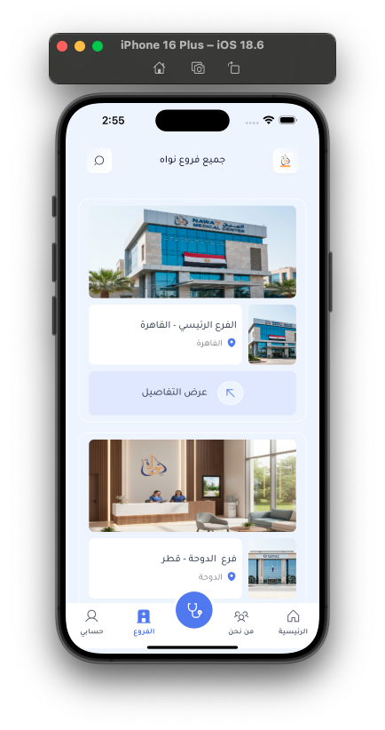</td>
    <td>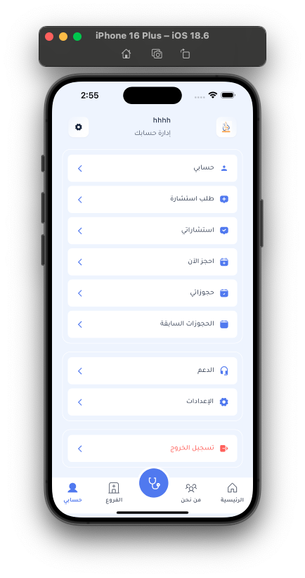</td>
    <td>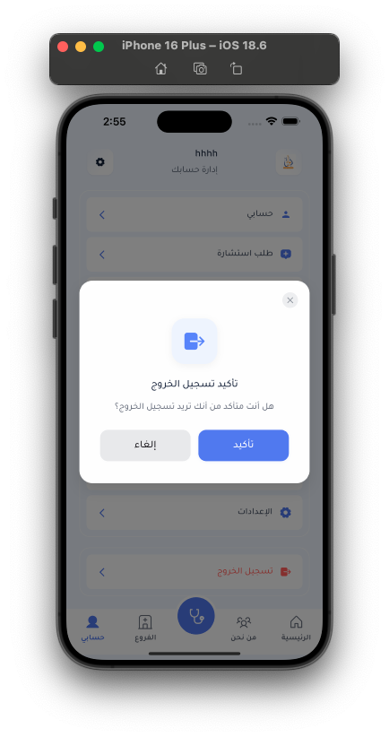</td>
  </tr>
  <tr>
    <td>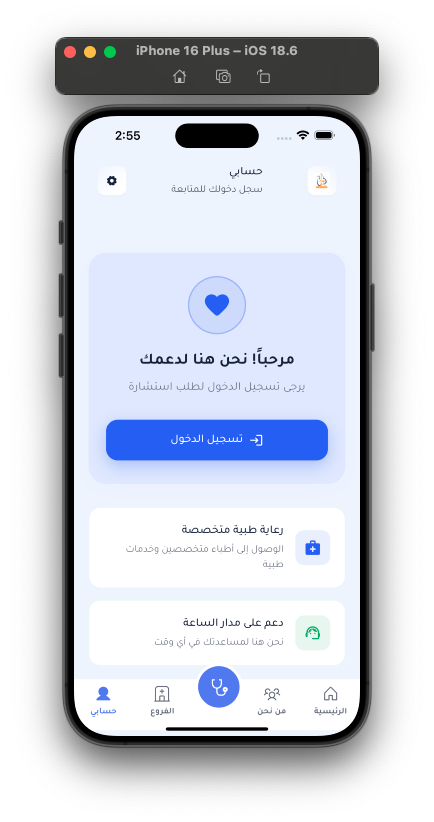</td>
    <td>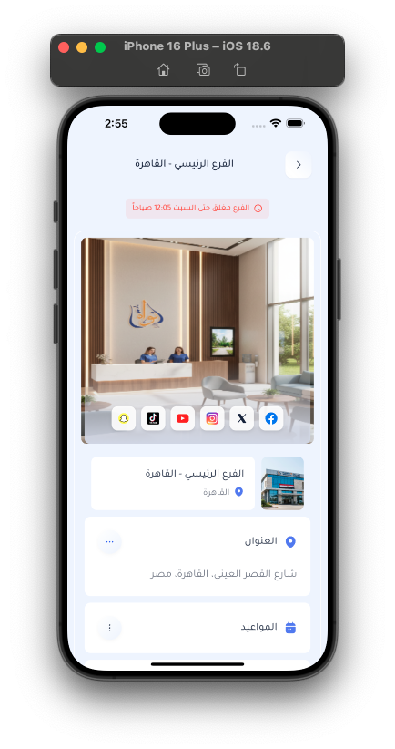</td>
    <td>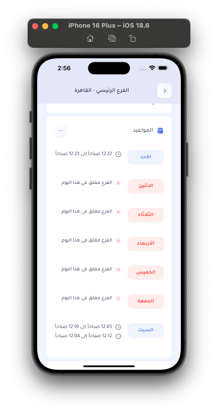</td>
    <td>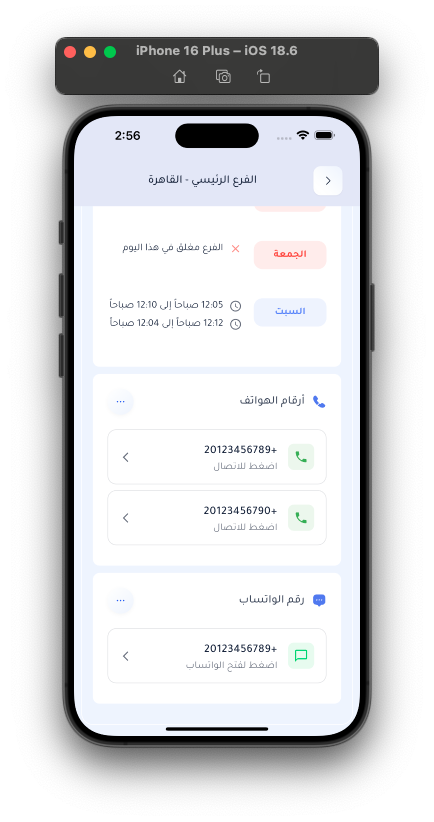</td>
  </tr>
  <tr>
    <td>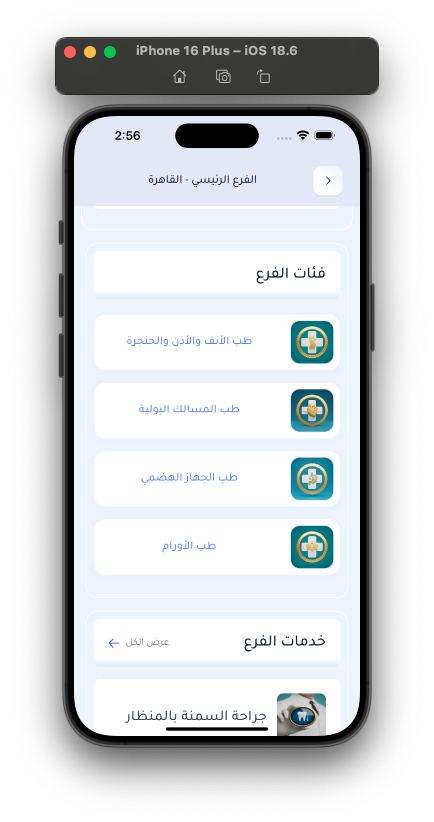</td>
    <td>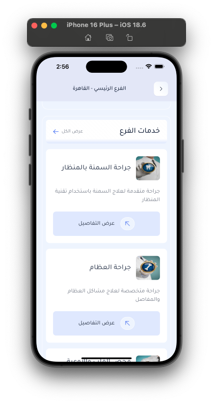</td>
    <td>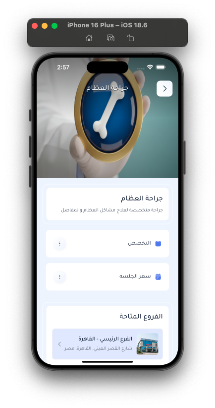</td>
    <td>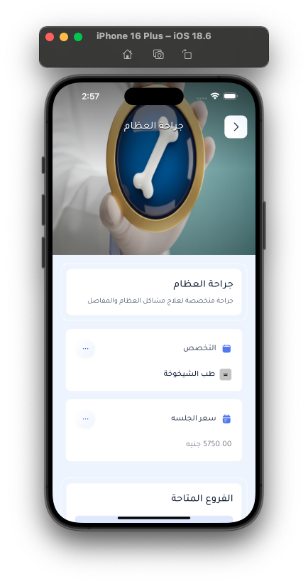</td>
  </tr>
  <tr>
    <td>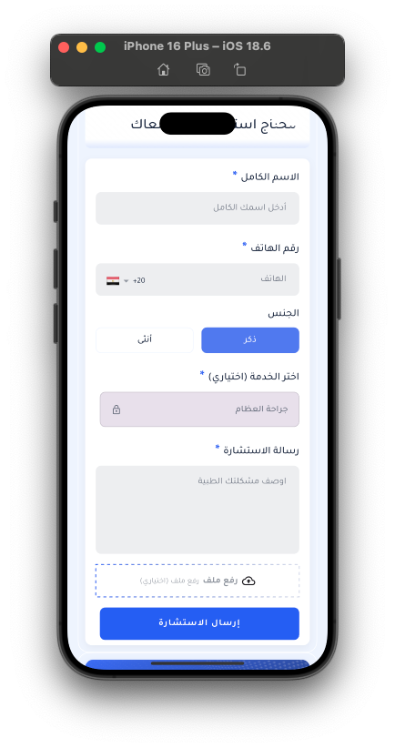</td>
    <td>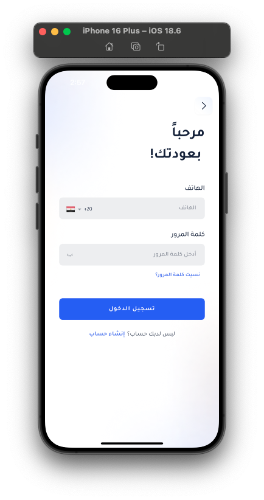</td>
    <td>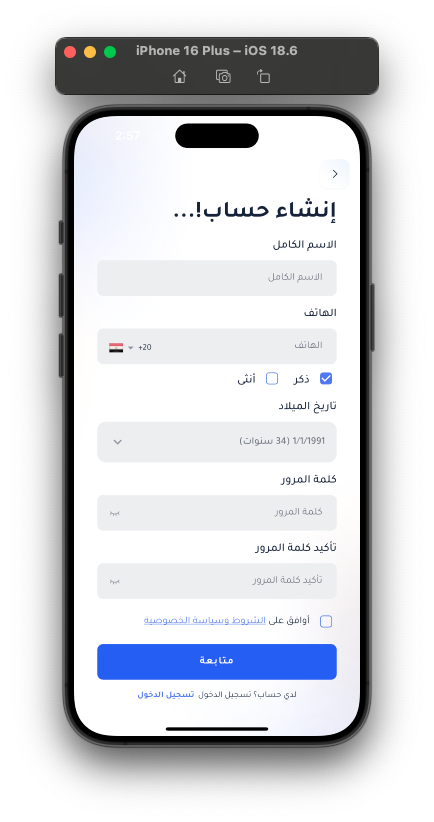</td>
    <td>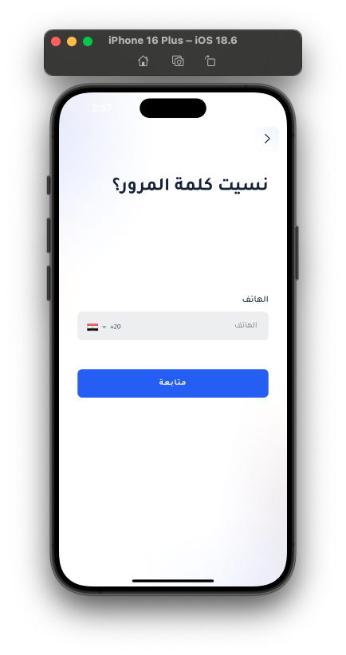</td>
  </tr>
</table>

## Demos (GIF Previews)

> Tip: GIFs may take a moment to load. If playback is slow, open them directly from the repo under `assets/demos/gifs/`.

### Onboarding


### Main Navigation


### Consultations & Services


### Branches & Services


### Auth Flow


### Settings & Localization


### Services Carousel


## Contact

- Email: <a href="mailto:eng.ashrf100@gmail.com?subject=Nawah%20Inquiry">eng.ashrf100@gmail.com</a>
- WhatsApp: <a href="https://wa.me/201287200535" target="_blank">+20 128 720 0535</a>
- Phone: <a href="tel:+201287200535">+20 128 720 0535</a>

---

Nawah sits alongside other Flutter portfolio entries in this repository. Add new assets or update screenshots by dropping media into `assets/` and referencing them here for a clean, repeatable presentation.
